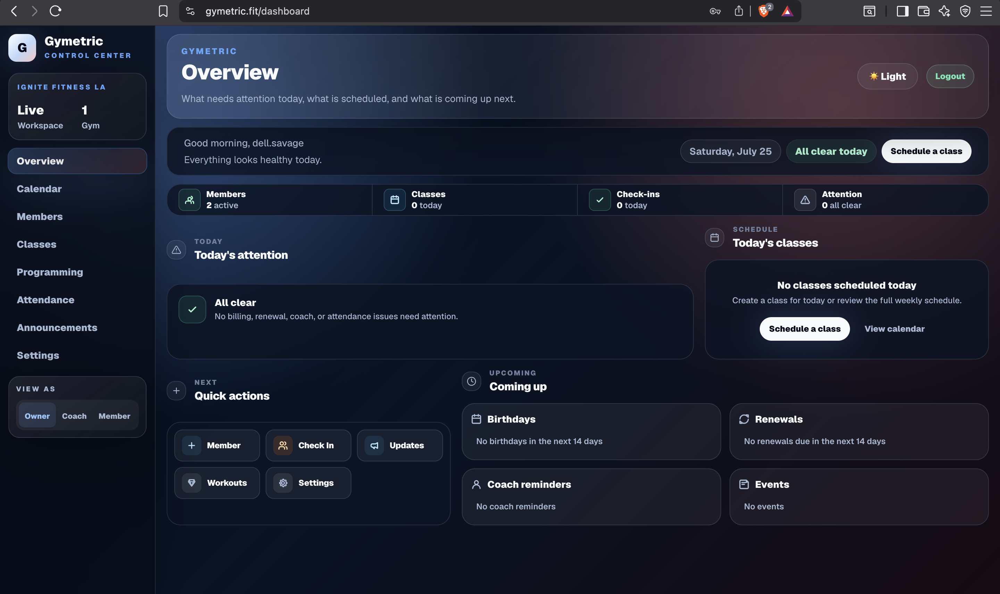
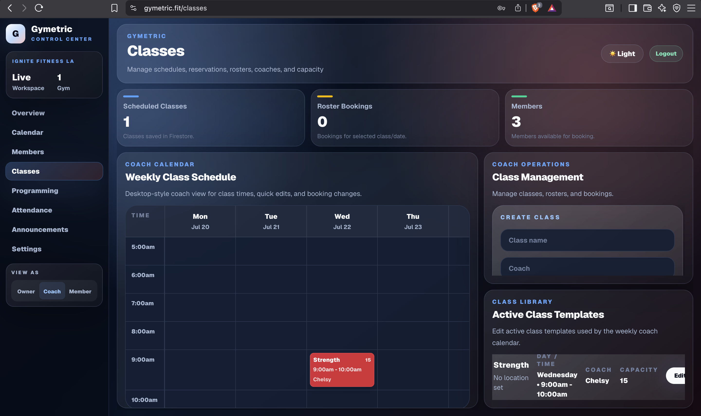
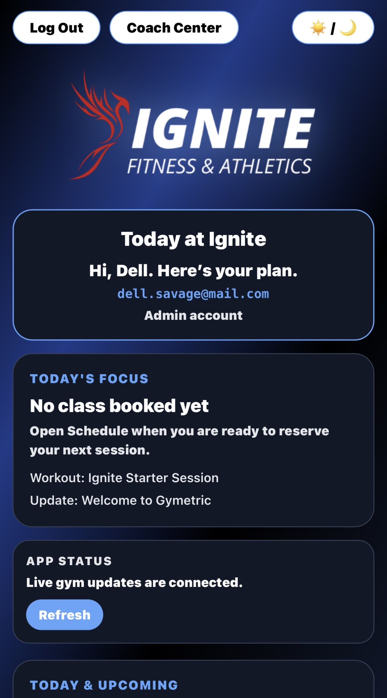
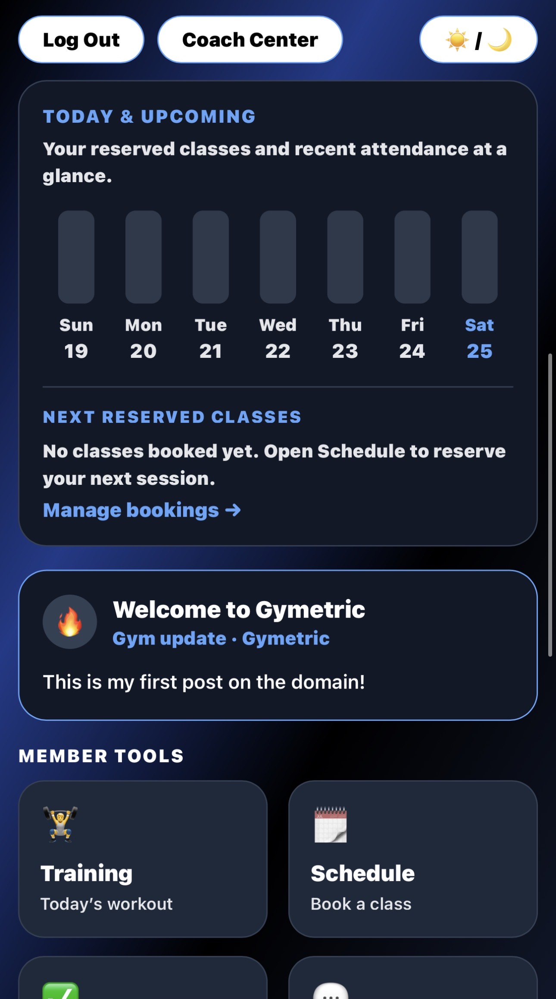
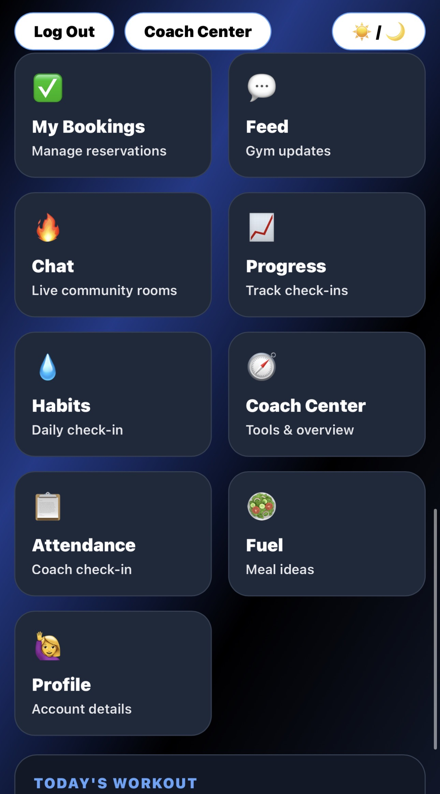
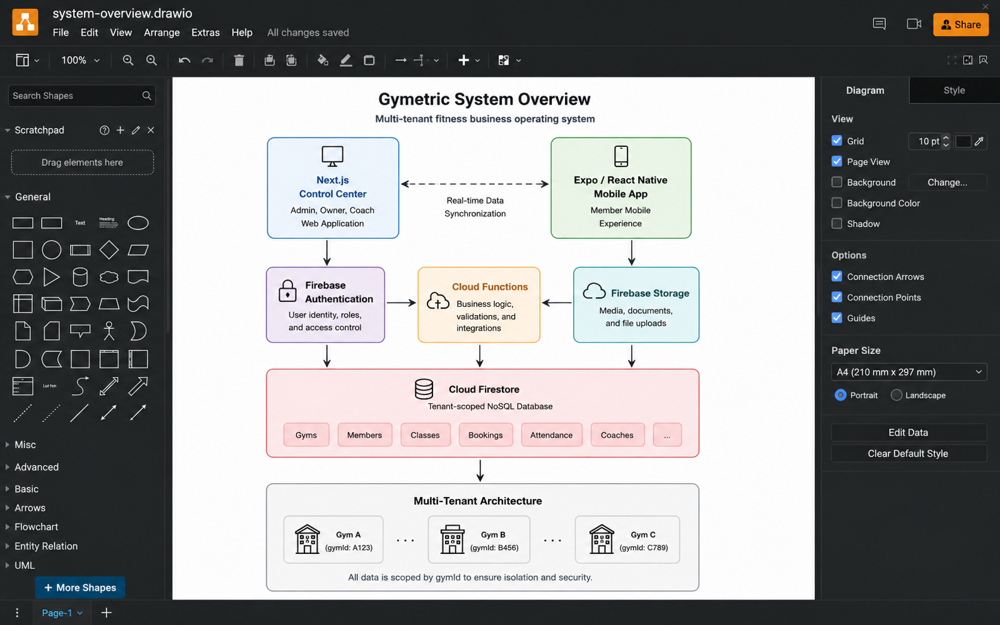

# Gymetric

Gymetric is a multi-tenant fitness business operating system for managing
classes, members, coaches, programming, attendance, communications, and
business operations.

## Product Preview

### Web Control Center

#### Overview Dashboard

#### Classes and Coach Scheduling

### Member Mobile Experience

Gymetric also includes a mobile member experience for bookings, updates,
attendance visibility, and day-to-day gym interaction.

  
  
  

## System Overview

For a more detailed breakdown, see the
[Architecture Documentation](./docs/architecture.md).

For details about tenant isolation and data scoping, see the
[Multi-Tenancy Documentation](./docs/multi-tenancy.md).

## Why I’m Building It

Many fitness businesses rely on disconnected tools for scheduling,
memberships, staff workflows, communications, and reporting.

Gymetric is designed around the idea that these systems should work together.

## Current Capabilities

- Class scheduling
- Member management
- Booking workflows
- Attendance tracking
- Coach workflows
- Announcements
- Member-facing mobile experience
- Tenant-specific branding and data

## Architecture

- Next.js web application
- Expo and React Native mobile application
- Firebase Authentication
- Firestore
- Cloud Functions
- Tenant-scoped data model

## Engineering Focus

- Multi-tenant architecture
- Role-based experiences
- Shared business rules
- Mobile and web synchronization
- Safe migration from legacy data sources

## Project Status

Gymetric is actively being developed. The production source repository is
private, but this repository documents the product, architecture, and
engineering decisions.

For current priorities and planned product phases, see the
[Development Roadmap](./docs/roadmap.md).

## My Role

I designed and developed the product architecture, web interface, mobile
application, tenant model, booking workflows, attendance workflows, and
backend integration.
